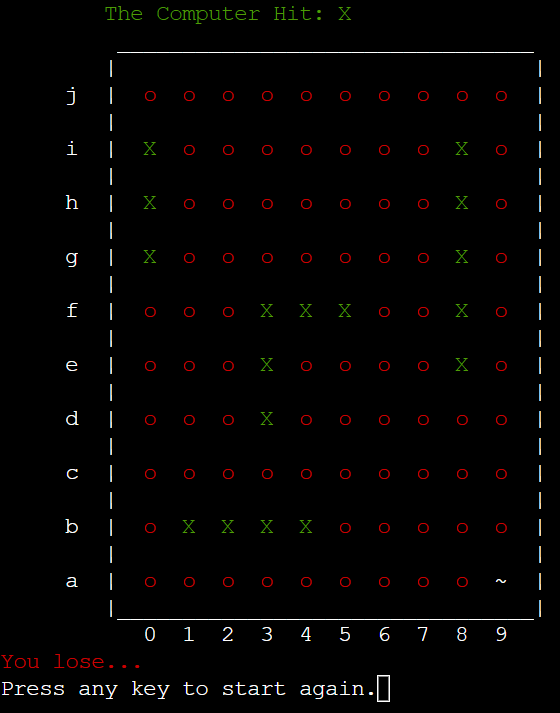

To Do:

Programming:
- Nice to have:
    - make it so someone can use 3e or e3
    - Add place ship function to class
    - create unit test to periodically check the board functionality (not required for grading)

README:
- Existing features
- Features left to implement
- Testing: User needs
- Testing: Challenges
- Validator testing
- Unfixed bugs
- Content
- Acknowledgements

Other:
- Nicer version of the flow chart (nice to have)
- Maybe put button in beside the terminal rather then below it? - It would mean the whole thing would fit on the screen without scrolling. What about title and button under it on the left and the terminal on the right?


Link to live site: https://cli-battleship-game.herokuapp.com/

# Battleship


## Table of contents
1. [Introduction](#introduction)
2. [How To play](#how-to-play)
3. [Features](#features)
    * [Existing Features](#existing-features)
    * [Future Features](#future-features)
4. [Data Model](#data-model)
5. [Testing](#testing)
    * [Solved Bugs](#solved-bugs)
    * [Validator testing](#validator-testing)
    * [Unfixed bugs](#unfixed-bugs)
5. [Deployment](#deployment)
6. [Credits](#credits)
    * [Content](#content)
    * [Acknowledgements](#acknowledgements)


## Introduction 

This is a command line version of the classic game battleships. The program allows the user to place their ships on their side of the board and then attack the computers ships on the computers board. The first to make 17 hits wins the game.

## How To Play

CLI Battleship is a command line take on the classic battleship game.

In this version, the player chooses a username and their board is created. The board has letters a to j in the y direction and number 0 to 9 in the x.

It then prompts the player to place their ships on the board. There are 5 ships in total of sizes 2, 3, 3, 4, and 5. The player must choose a starting point which is done by giving coordinates which is a number and letter pairing (e.g. 3e). Then they are asked what direction they would like to place the ship (i.e. up, down, left, and right).

Once all ships are placed the player will be prompted to make the first attack. This means you are attacking the computers board, which shows on the screen as blank. Using the same coordinate system as placing the ships you can attack (e.g. 8f).

The computer will make its move and will continue back and forth until one player has sunk all the other players ships.

If the user wins their username and time is added to the leader board and if they are in the top 3 they will show up on the opening screen.

## Features

### Existing features

1. Opening Screen

* The opening screen shows the title, leader board, and asks if you want to play or get instructions. 


2. Instructions

* The instruction screen gives the user instructions on how to play the game


2. Input Username

* After typing p and pressing enter the user is asked for their username


3. Player board

* The player board is the visual representation of the board, showing ships (#) and ocean (~):


4. Placing a ship

* The player is then asked to place 5 ships of lengths 2, 3, 3, 4, and 5 in that order. By first inputting coordinates and then a direction.


5. Attacking The Computer

* Once all ships are placed the player is then asked to pick attack coordinates of the opponents board (e.g. 5c)


6. Player and Computer Missing

* Each time there is a miss (hitting ocean character) the following prompts are shown for player and computer

    Player missing


    Computer missing


7. Player and Computer Hitting

* Each time there is a hit (hitting a ship character) the following prompts are shown for player and computer

    Player Hits


    Computer Hits


8. Player or Computer Winning

* The following shows the screen when a player wins and the computer wins respectively

    - Player Wins


    - Computer Wins



### Future Features

Given more time to develop this project here are features I would have liked to implement:

1. Use N, S, E, W instead of up, down, left, right

I think this would have fit in a lot better with the theme of battleship. To implement this I would change the DIRECTIONS list to N, S, E, W and change where ever there are comparisons to mirror this change.

2. "You sunk my battleship!!"

I would have liked to add the feature where by when a whole ship is destroyed that there is a prompt to say so. I would do this by creating a list that contained lists that hold the position of the ships on the board. For example:

```
ship_placements = [['3a', '3b', '3c'], ['0h', '1h', '2h', '3h']]
```

Where each list item in ship_placement represents a ships placement on the board. Then each time an attack is made the the game will loop through this list to check if a ship has been sunk.

3. Smarter Computer

I would have also liked to implement a weighted system, where by the computer after making a hit will focus around that hit until a ship has been sunk.

I would have also like to have tracked the computers moves to allow the computer to make quicker moves as the game goes on.

4. Functions inside class

It might not be a feature but I would have liked to add the function for placing ships into the PlayerBoard class.

## Data Model

Two types of data models were used in this project. A PlayerBoard class and an Google sheet. 

The PlayerBoard class holds the board, the name associated with the board, the symbol used to fill the board when created. It also holds a function used to print the current state of the board, in the case of the computer it prints a blank board and only shows hits and misses.

The Google sheet could be seen as a relational database (albeit a very small one), or a visual representation of a csv file. Either way the Goggle sheet stores The username given at the start of the game and the time the user took to win the game.

## Testing

### Solved Bugs

Inputs:

For all input testing the following types of inputs were tested: Numeric, alphanumeric, a mix of both, special characters, and no input at all. The player can also use uppercase and lowercase for the proper inputs. For each input if anything except the correct input is entered the following prompts are shown to guide the player.

1. Choosing p or i at the opening screen:


2. Placing ship input


3. Attack Coordinates input


4. 


2. 


### Validator testing

In this project, the errors that I mostly came across were the following:

1. Pep8 E501 - line too long:
* This error was rectified either by using either a backslash or quotation marks to split a long piece of text into two and separating them out onto two lines. 


2. 

### Unfixed bugs 

- limit user name size


## Deployment

This program was deployed to Heroku, following the below steps:

1) Push most up-to-date code to Github

2) Create a list of requirements by typing the following into the terminal:
pip3 freeze > requirements.txt

3) Push the requirements to Github

4) Logon to Heroku

5) Select create new app 

6) Add app name 

7) Add app region

8) Select 'Create app'

9) Open up the Settings tab, on the top ribbon

10) In 'Config Vars' select 'Reveal Config Vars'

11) Add 'PORT' as a key and '8000' as a value

12) In 'Buildpacks' select 'Add buildpack' and choose python. Then, repeat for nodejs (order is important; python first followed by nodejs) 

13) Navigate to 'Deploy' on the top ribbon

14) In 'Deployment method', select 'Github', once clicked it should say 'connected'

15) Enter a repository in Github to connect to and click 'Search'

16) Once repository has been found, click 'Connect' to link new app to Github repository

17) In 'Automatic deploys', select the 'Enable Automatic Deploy' option

18) To view your command line on the Heroku platform, once a new code has been pushed to Github, log on to Heroku

19) Select the required app that appears on your home screen

20) Select 'Open app' on the right hand side of the screen 

21) The app should appear in a new tab on the web browser

22) The link to my Heroku app is:
<insert link>


## Credits 

### Content

I would like to acknowledge the below organizations:

* Code institute for providing a python essentials template to work from and a terminal on Heroku to deploy my project.
* The following site for the rules of battle ships []()
* To create a flowchart for my project, [diagrams.net](https://app.diagrams.net/). 
* The external python library [termcolor](https://pypi.org/project/termcolor/) to import colour to text.
* [Pep8 online](http://pep8online.com/), for code validation checking.

### Acknowledgements

